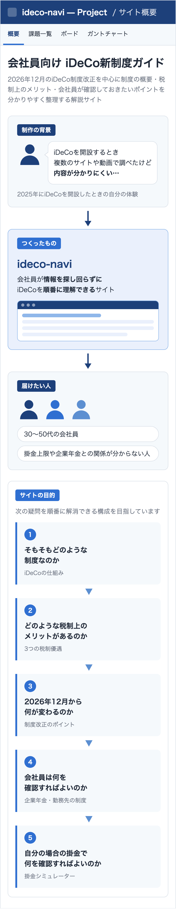
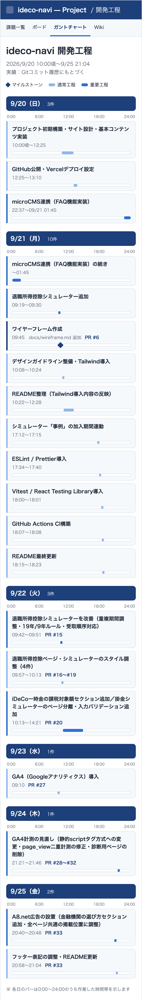
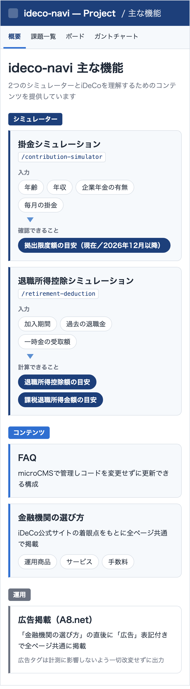
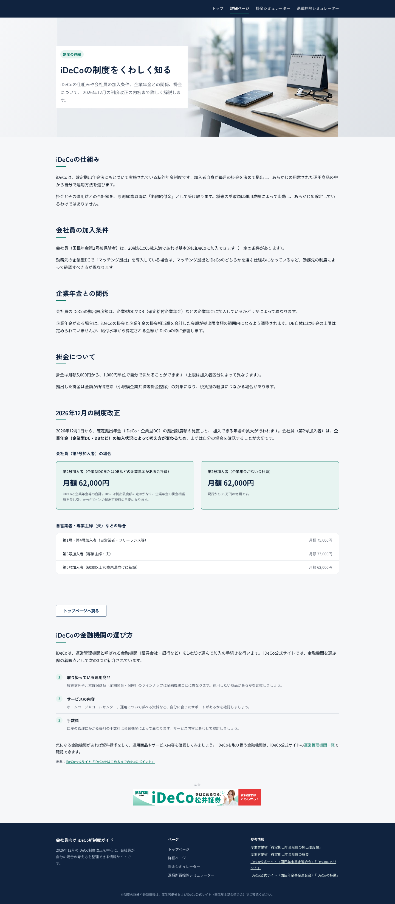
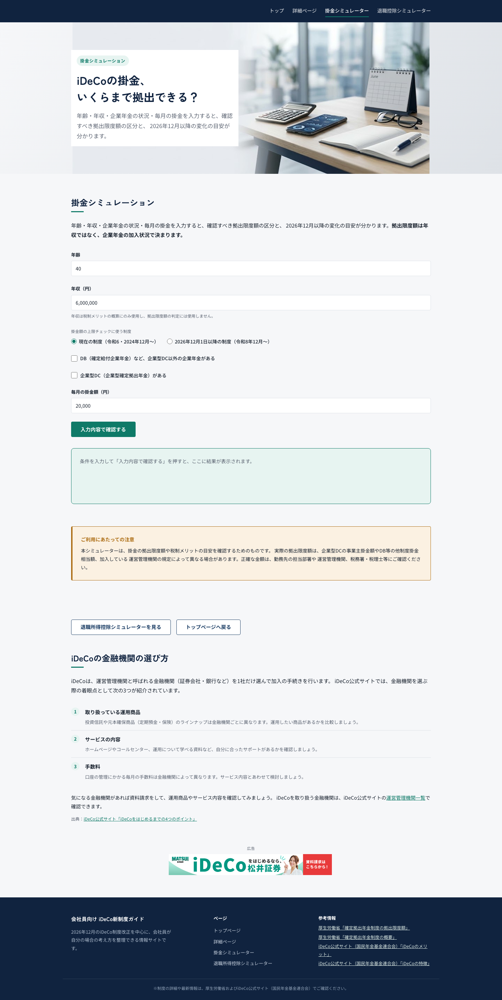
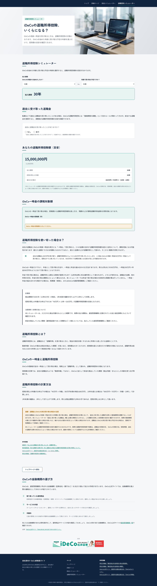
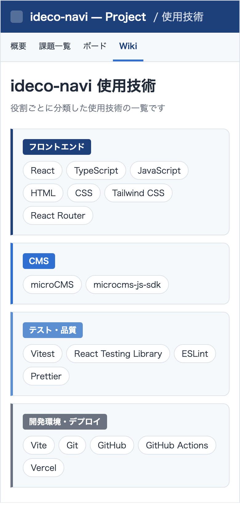
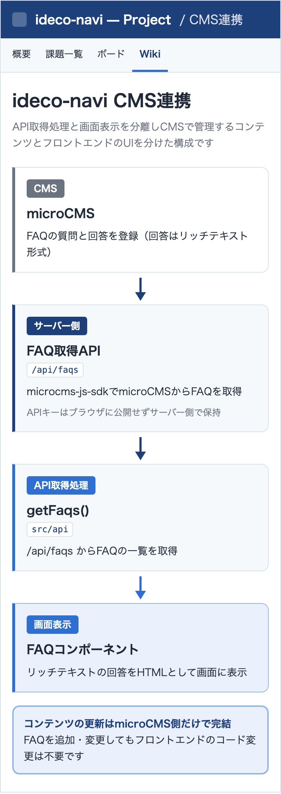
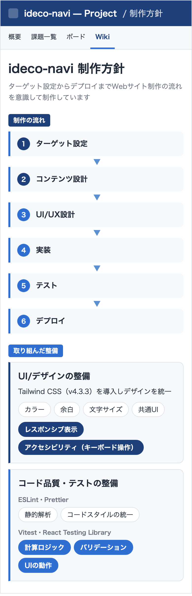
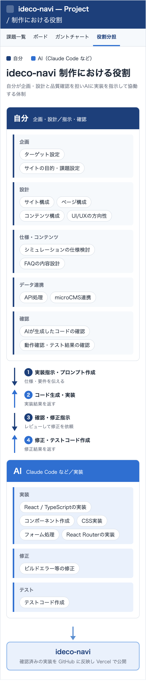

# 会社員向け iDeCo新制度ガイド

## サイト概要

  

## 開発工程

  

## サイト構成

  

## 主な機能

  

## 画面構成

本番サイト（<https://ideco-navi.vercel.app/>）で実際に公開・運用している画面です。各ページの下部には金融機関の選び方と広告を掲載しています。

### トップページ

iDeCoの概要と税制上のメリット・2026年12月の制度改正・会社員が確認すべきポイントをまとめたページです。

### 主なページ・機能

<table align="left">
  <tr>
    <td width="370" valign="top">
      <b>制度について（<code>/about</code>）</b>  
        
      iDeCoの仕組みや加入条件・企業年金との関係・2026年12月の制度改正をくわしく解説するページです。
    </td>
  </tr>
</table>
<table align="right">
  <tr>
    <td width="370" valign="top">
      <b>掛金シミュレーター（<code>/contribution-simulator</code>）</b>  
        
      年齢・年収・企業年金の状況・毎月の掛金を入力して拠出限度額の区分と2026年12月以降の目安を確認できるページです。
    </td>
  </tr>
</table>
 
<table align="left">
  <tr>
    <td width="370" valign="top">
      <b>退職所得控除シミュレーター（<code>/retirement-deduction</code>）</b>  
        
      iDeCoの開始年齢と受取予定年齢から退職所得控除額と一時金の課税対象額の目安を計算できるページです。
    </td>
  </tr>
</table>
 

## 使用技術

  

技術要素どうしの関係は以下の構成図の通りです。

  

## CMS連携

  

## 制作方針

  

## 制作における役割

企画・設計と確認を自分が担いClaude CodeなどのAIに実装を指示して制作しています。

  

## 情報源

制度に関する情報は以下の公的な情報をもとに構成しています。

- 厚生労働省
- 国税庁
- iDeCo公式サイト（国民年金基金連合会）

## 注意事項

本サイトはiDeCoへの加入や掛金について個別の金融アドバイスを行うものではありません。

シミュレーション結果についても実際の加入条件や制度上の取扱いを確認するための参考情報として扱っています。

本サイトにはアフィリエイト広告（A8.net）を掲載しています。
