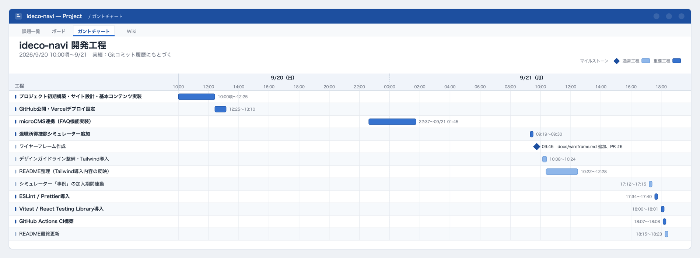
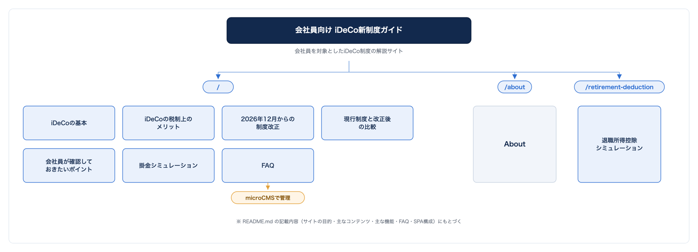
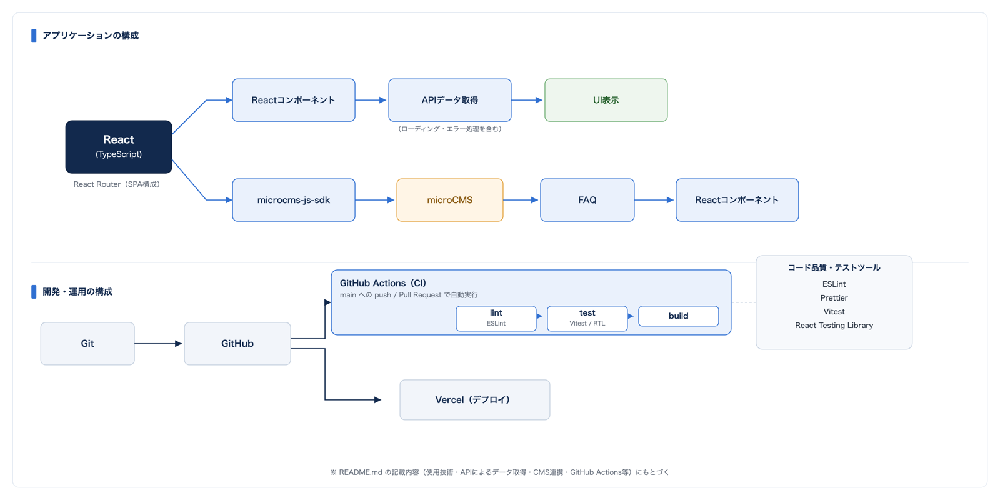

# 会社員向け iDeCo新制度ガイド

会社員を対象としたiDeCo制度の解説サイトです。

2026年12月から予定されているiDeCo制度改正を中心に制度の概要や税制上のメリット会社員が確認しておきたいポイントを分かりやすく整理することを目的としています。

## 制作の背景

2025年にiDeCoを開設するときに複数のサイトや動画で調べましたが内容がなかなか分かりにくいと感じました。

そこで会社員が情報を探し回らずにiDeCoを順番に理解できるサイトを作りたいと考えました。

## サイトの目的

iDeCoについて

- そもそもどのような制度なのか
- どのような税制上のメリットがあるのか
- 2026年12月から何が変わるのか
- 会社員は何を確認すればよいのか
- 自分の場合の掛金について何を確認すればよいのか

を順番に理解できる構成を目指しています。

## ターゲット

30〜50代の会社員を想定しています。

iDeCoという制度の名前は知っているものの自身の掛金上限や企業年金との関係について詳しく分からない人を主な対象としています。

## 開発工程

## サイト構成

サイト全体の構成は以下の図の通りです。

## 主な機能

### 掛金シミュレーション

以下の情報を入力して掛金について確認できる構成としています。

- 年齢
- 年収
- 企業年金の有無
- 企業型DCの有無
- 毎月の掛金

年収だけで掛金上限を判断するのではなく企業年金などの条件を含めて確認する必要があることを考慮しています。

### 退職所得控除シミュレーション

iDeCoの一時金を受け取る際に関係する退職所得控除について確認できるシミュレーターを追加しています。

以下の情報を入力して退職所得控除額を確認できる構成としています。

- iDeCoの加入期間
- 加入期間の年数・月数

加入期間をもとに退職所得控除の計算年数を算出し

- 退職所得控除額
- 計算に使用した年数
- 計算式

を表示します。

加入期間に1年未満の端数がある場合は1年に満たない期間を切り上げて計算する仕様としています。

本シミュレーターでは退職所得控除額の確認を目的としており他の退職金との重複や受取時期などを考慮した実際の税額計算は行っていません。

シミュレーターの下には、転職して前職の退職金を受け取っている場合の計算例（重複期間の調整を含む）を掲載しています。この計算例で使用する加入期間は上記シミュレーターの入力値と連動しており、加入期間を変更すると計算例側の結果も同じ計算ロジックを使って自動的に更新されます。

### FAQ

iDeCoの基本や会社員の加入条件
企業型DCとの関係2026年12月からの制度改正などについて整理しています。

microCMS側でFAQを追加・変更することでフロントエンドのコードを変更せずにコンテンツを更新できる構成としています。

## 使用技術

- React
- TypeScript
- JavaScript
- HTML
- CSS
- Tailwind CSS
- React Router
- Vite
- microCMS
- microcms-js-sdk
- Git
- GitHub
- GitHub Actions
- Vercel
- ESLint
- Prettier
- Vitest
- React Testing Library

技術要素どうしの関係は以下の構成図の通りです。

## CMS連携

API取得処理と画面表示を分離することで
CMSで管理するコンテンツとフロントエンドのUIを分けた構成としています。

microCMSのリッチテキスト形式で登録したFAQの回答を
HTMLとして画面に表示しています。

## 制作方針

このサイトでは単にReactで画面を作るだけではなく

**ターゲット設定**

→ 課題整理  
→ サイト構成  
→ コンテンツ設計  
→ UI/UX設計  
→ React/TypeScriptによる実装  
→ API・CMS連携  
→ SPA化  
→ テスト  
→ GitHub  
→ Vercelへのデプロイ

というWebサイト制作の流れを意識して制作しています。

### UI/デザインの整備

Tailwind CSS（v4.3.3）を導入し、既存のCSS構成を整理しました。

- デザインガイドラインに沿って、カラー・余白・文字サイズ・レイアウトのルールを整理
- Header・Footer・ボタン・カード・フォームなど共通UIのデザインを統一
- PC・タブレット・スマートフォンでのレスポンシブ表示を整理
- フォーカス表示など、キーボード操作を考慮したアクセシビリティ対応を実施
- 既存のCSSとTailwind CSSを整理しながら、既存機能はそのまま維持

### コード品質・テストの整備

ESLint・Prettierを導入し、コードの静的解析とフォーマットを統一しました。

- ESLintはTypeScript 7系との互換性の都合により、対象をJavaScript/JSXファイルに限定
- TypeScript固有の型チェックは既存の`tsc -b`が担う構成のまま維持
- Prettierでコードスタイル（セミコロンなし・シングルクォートなど）を統一

Vitest・React Testing Libraryを導入し、主要な計算ロジックとUIの動作をテストコードで確認できる状態にしました。

- 退職所得控除シミュレーター・iDeCo掛金シミュレーターの計算ロジック
- 入力値のバリデーション
- 計算結果やエラー表示などのUI
- microCMSなどAPIに依存する処理は`fetch`をモックして検証し、実際のAPIには依存しない構成

## 制作における役割

### 自分

- ターゲット設定
- サイトの目的・課題設定
- ページ構成
- コンテンツ構成
- シミュレーションの仕様検討
- FAQの内容設計
- UI/UXの方向性
- 全体のサイト構成

### AI

Claude CodeなどのAIを活用して

- React / TypeScriptの実装
- コンポーネント作成
- CSS実装
- フォーム処理
- API処理
- microCMS連携
- React Routerの実装
- ビルドエラー等の修正
- テストコード作成

を行っています。

AIが生成したコードについては
実装内容を確認しながら制作を進めています。

## 情報源

制度に関する情報は以下の公的な情報をもとに構成しています。

- 厚生労働省
- iDeCo公式サイト（国民年金基金連合会）

## 注意事項

本サイトはポートフォリオとして制作したものであり
iDeCoへの加入や掛金について個別の金融アドバイスを行うものではありません。

シミュレーション結果についても実際の加入条件や制度上の取扱いを確認するための参考情報として扱っています。

## 今後の予定

- Heroビジュアルの追加・調整