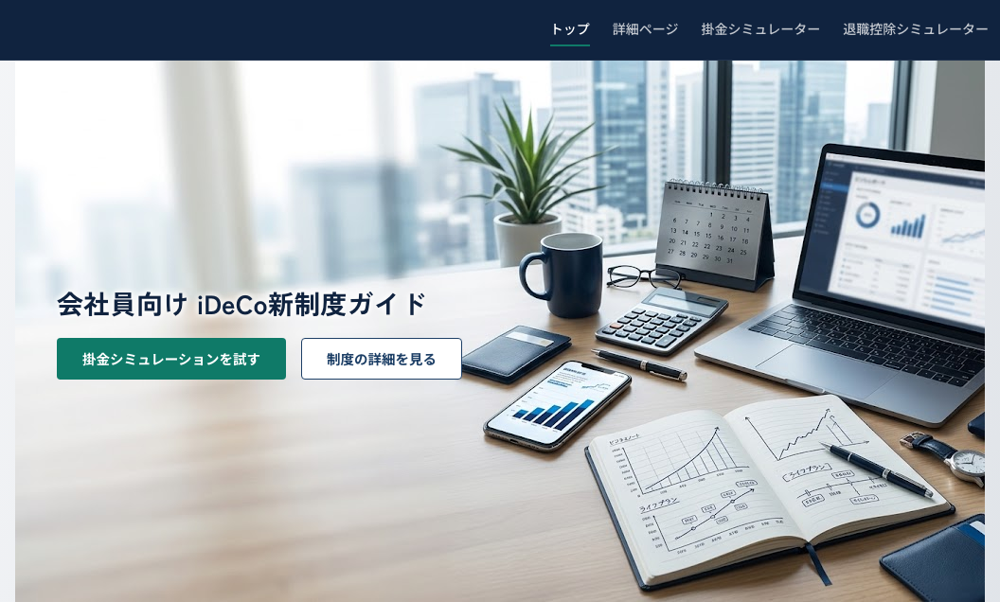
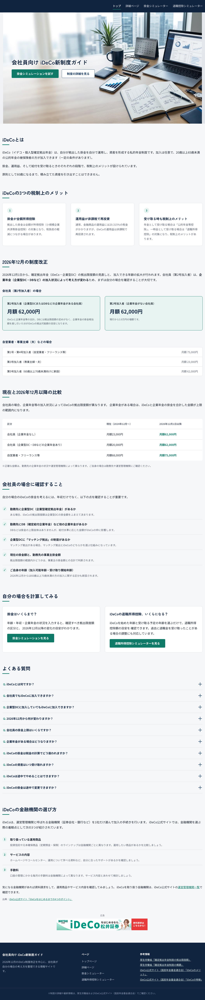
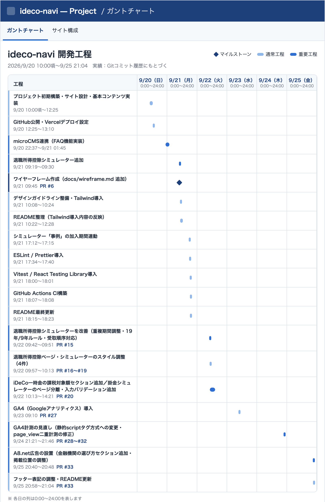
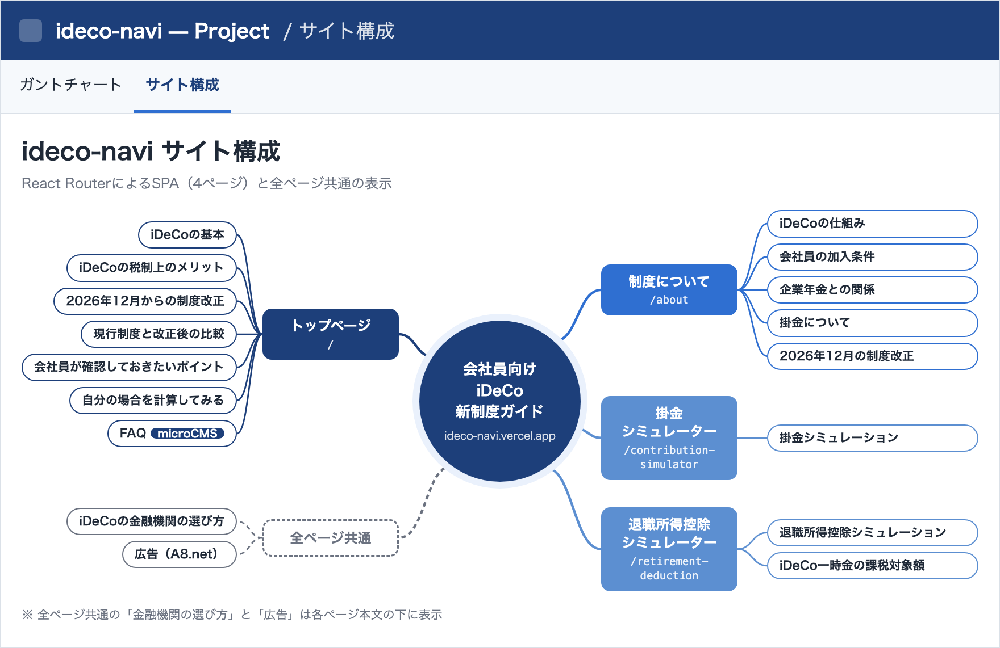
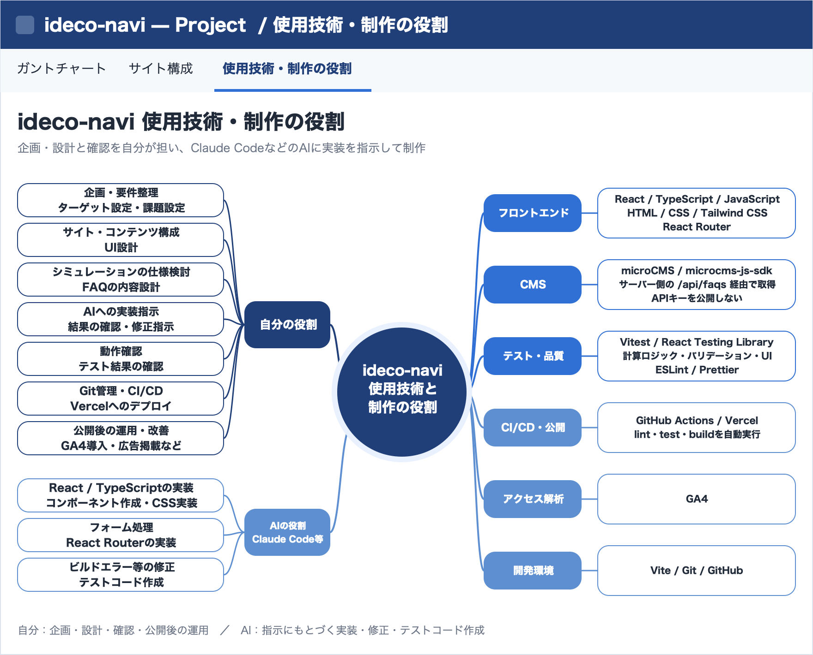

# 会社員向け iDeCo新制度ガイド

## サイト概要

会社員を対象としたiDeCo制度の解説サイトです。2026年12月のiDeCo制度改正を中心に制度の概要・税制上のメリット・会社員が確認しておきたいポイントを整理しています。

- 対象：iDeCoの名前は知っているものの掛金上限や企業年金との関係が分からない30〜50代の会社員
- 本番サイト：<https://ideco-navi.vercel.app/>

  <picture>
    <source media="(max-width: 600px)" srcset="./docs/images/top-page-first-view-sp.png">
    
  </picture>

トップページ全体を見る

  <picture>
    <source media="(max-width: 600px)" srcset="./docs/images/top-page-sp.png">
    
  </picture>

## 開発工程

2026年9月20日〜9月25日の実績です（Gitのコミット履歴にもとづく）。企画・設計から実装・テスト・CI構築を経て公開後にGA4導入と広告掲載を行いました。

  

## サイト構成

React RouterによるSPAで4ページ構成です。各ページの下部には金融機関の選び方と広告を共通で表示しています。

  

## 使用技術・制作における役割

企画・設計と確認を自分が担い、Claude CodeなどのAIに実装を指示して制作しています。使用技術と役割分担を以下にまとめています。

  

## 情報源

制度に関する情報は以下の公的な情報をもとに構成しています。

- 厚生労働省
- 国税庁
- iDeCo公式サイト（国民年金基金連合会）

## 注意事項

本サイトはiDeCoへの加入や掛金について個別の金融アドバイスを行うものではありません。

シミュレーション結果についても実際の加入条件や制度上の取扱いを確認するための参考情報として扱っています。

本サイトにはアフィリエイト広告（A8.net）を掲載しています。
