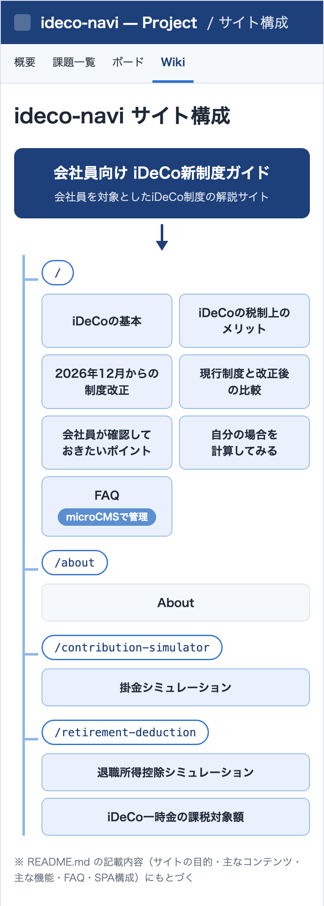

# 会社員向け iDeCo新制度ガイド

## サイト概要

会社員を対象としたiDeCo制度の解説サイトです。2026年12月のiDeCo制度改正を中心に制度の概要・税制上のメリット・会社員が確認しておきたいポイントを整理しています。

- 対象：iDeCoの名前は知っているものの掛金上限や企業年金との関係が分からない30〜50代の会社員
- 本番サイト：<https://ideco-navi.vercel.app/>

## 開発工程

2026年9月20日〜9月25日の実績です（Gitのコミット履歴にもとづく）。企画・設計から実装・テスト・CI構築を経て公開後にGA4導入と広告掲載を行いました。

<picture>
  <source media="(max-width: 600px)" srcset="./docs/development-process/development-process2.png">
  
</picture>

## サイト構成

React RouterによるSPAで4ページ構成です。各ページの下部には金融機関の選び方と広告を共通で表示しています。

  

## 主な機能

- **iDeCo制度の解説**：仕組み・加入条件・企業年金との関係・税制上のメリット
- **2026年12月の制度改正の解説**：現行制度と改正後の拠出限度額の比較
- **掛金シミュレーター**：年齢・年収・企業年金の有無などから現在と2026年12月以降の拠出限度額の目安を確認
- **退職所得控除シミュレーター**：加入期間や過去の退職金から退職所得控除額と課税退職所得金額の目安を計算
- **FAQ**：microCMSで管理しコードを変更せずに更新
- **金融機関情報**：iDeCo公式サイトの着眼点をもとに金融機関の選び方を全ページ共通で掲載
- **アフィリエイト広告掲載**：A8.netの広告を「広告」表記付きで掲載（広告タグは改変せずに出力）
- **GA4によるアクセス計測**

## 使用技術

- **フロントエンド**：React／TypeScript／JavaScript／HTML／CSS／Tailwind CSS／React Router
- **CMS**：microCMS／microcms-js-sdk（APIキーを公開しないようサーバー側の`/api/faqs`経由でFAQを取得）
- **テスト・品質**：Vitest／React Testing Library（計算ロジック・バリデーション・UI）／ESLint／Prettier
- **CI/CD・公開**：GitHub Actions（lint・test・buildを自動実行）／Vercel
- **アクセス解析**：GA4
- **開発環境**：Vite／Git／GitHub

## 制作における役割

企画・設計と確認を自分が担いClaude CodeなどのAIに実装を指示して制作しています。

- **自分**
  - 企画・要件整理（ターゲット設定・課題設定）
  - サイト構成・コンテンツ構成・UI設計
  - シミュレーションの仕様検討・FAQの内容設計
  - Claude CodeなどのAIへの実装指示と実装結果の確認・修正指示
  - 動作確認・テスト結果の確認
  - Git管理・CI/CD・Vercelへのデプロイ
  - 公開後の運用・改善（GA4導入・広告掲載など）
- **AI（Claude Codeなど）**
  - React / TypeScriptの実装・コンポーネント作成・CSS実装
  - フォーム処理・React Routerの実装
  - ビルドエラー等の修正・テストコード作成

## 情報源

制度に関する情報は以下の公的な情報をもとに構成しています。

- 厚生労働省
- 国税庁
- iDeCo公式サイト（国民年金基金連合会）

## 注意事項

本サイトはiDeCoへの加入や掛金について個別の金融アドバイスを行うものではありません。

シミュレーション結果についても実際の加入条件や制度上の取扱いを確認するための参考情報として扱っています。

本サイトにはアフィリエイト広告（A8.net）を掲載しています。
