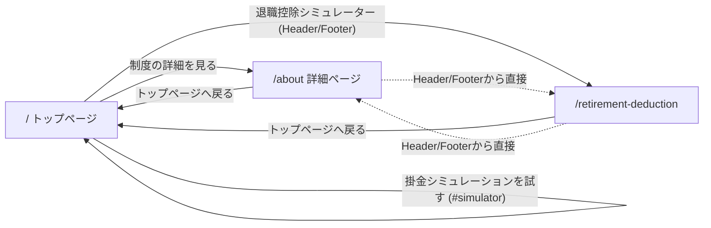

# Wireframe

会社員向け iDeCo新制度ガイド（`ideco-navi`）のワイヤーフレームです。
実装済みの `src/` 配下のコードを確認したうえで、実際に存在するページ・コンポーネント・データの流れだけを記載しています。架空のページや未実装の機能は含みません。

- サイト名：会社員向け iDeCo新制度ガイド
- ターゲット：30〜50代の会社員（iDeCoという名前は知っているが、自分の場合の掛金上限や退職所得控除がよく分からない層）
- 目的：iDeCoとは何か → 税制上のメリット → 2026年12月からの制度改正 → 会社員が確認すべきポイント → 掛金の確認方法 → 退職所得控除の確認方法、の順に理解できること

---

## 1. サイト全体構成

`src/App.tsx` で定義されている実際のルーティングは以下の3ページのみです（すべて `Layout` 配下＝Header/Footer共通）。

```
Layout（Header + Outlet + Footer）
├── / … トップページ（HomePage）
│   ├── Hero
│   ├── iDeCoとは
│   ├── iDeCoの3つの税制上のメリット
│   ├── 2026年12月の制度改正
│   ├── 現在と2026年12月以降の比較
│   ├── 会社員の場合に確認すること
│   ├── 掛金シミュレーション（#simulator）
│   └── よくある質問（FAQ / microCMS）
│
├── /about … 詳細ページ（AboutPage）
│   ├── iDeCoの仕組み
│   ├── 会社員の加入条件
│   ├── 企業年金との関係
│   ├── 掛金について
│   ├── 2026年12月の制度改正（ReformSectionを再利用）
│   └── トップページへ戻る
│
└── /retirement-deduction … 退職所得控除シミュレーター（RetirementDeductionPage）
    ├── ページ紹介（イントロ）
    ├── 退職所得控除シミュレーター（#simulator）
    ├── 退職所得控除とは？
    ├── iDeCoの一時金と退職所得控除
    ├── 退職所得控除の計算方法
    ├── 計算例
    ├── 計算例②：転職して前職の退職金を受け取っている場合
    ├── 注意事項（計算方法について）
    ├── 重要：退職金とiDeCoを両方受け取る場合の注意
    ├── 参考情報（出典リンク）
    └── トップページへ戻る
```

Mermaidでのページ遷移図（Header/Footerのリンクに基づく）：



3ページとも Header の3つのナビリンク（トップ／詳細ページ／退職控除シミュレーター）と Footer の同じ3リンクから相互に行き来できます。すべて `react-router-dom` の `Link` / `NavLink` によるSPA遷移です。

---

## 2. 共通レイアウト

`src/components/layout/Layout.tsx` が `Header` → `<Outlet />`（ページ本体） → `Footer` の順に描画します。

### Header（`components/layout/Header.tsx`）

- **役割**：サイト全体の入口。現在地の表示とページ間移動。
- **主要な情報**：サイトロゴ（「会社員向け iDeCo新制度ガイド」。狭幅では「iDeCo新制度ガイド」に短縮表示）
- **ナビゲーション**：トップ（`/`）／詳細ページ（`/about`）／退職控除シミュレーター（`/retirement-deduction`）の3リンク。`NavLink` で現在地に下線ハイライト
- **CTA**：Header自体に明示的なCTAボタンはなし（ナビリンクが導線）
- **レスポンシブ**：`position: sticky` で常に画面上部に固定。768px以下で高さを詰め、600px以下でロゴを短縮表示、400px以下ではナビが折り返して2行になっても崩れないよう `flex-shrink: 0` で高さを可変に

```
[ロゴ]                          [トップ] [詳細ページ] [退職控除シミュレーター]
```

### Main（`<Outlet />`）

- 各ページのコンテンツが入る領域。`#root` を`flex-direction: column`にし、`main { flex: 1 }`でFooterを画面下部に押し出す構成。

### Footer（`components/layout/Footer.tsx`）

- **役割**：サイト概要の再掲、主要ページへの再導線、制度情報の出典明示
- **主要な情報**：3カラム構成
  1. サイト概要（ロゴ＋説明文）
  2. ページリンク（トップ／詳細ページ／退職所得控除シミュレーター）
  3. 参考情報（`SourceList`。iDeCoデータ取得元の出典リンクを表示。データ未取得時は非表示）
- **CTA**：ページ内リンクのみ（外部への購入・登録等のCTAはなし）
- **下部**：「本サイトはポートフォリオ用の制作物です」という免責の1行
- **レスポンシブ**：768px以下で3カラム→1カラムに積み替え

```
[サイト概要]        [ページ]            [参考情報]
------------------------------------------------
※ポートフォリオ用の免責文（1行）
```

---

## 3. 各ページのワイヤーフレーム

### 3-1. トップページ（`/`, HomePage）

- **ページの目的**：iDeCoの基本〜2026年12月の制度改正〜会社員が確認すべきこと〜掛金シミュレーション〜FAQまでを、読み進めるだけで一通り理解できるようにする
- **想定ユーザー**：iDeCoという単語は知っているが、自分の場合の掛金や制度改正の影響が分からない会社員
- **ユーザーが最初に確認する情報**：Heroの「2026年12月、iDeCoの制度が変わります」というテーマと、「会社員は企業年金の加入状況によって考え方が変わる」というメッセージ
- **主要コンテンツ**：iDeCoとは／3つの税制メリット／2026年12月の制度改正／現在との比較／確認すべきこと／掛金シミュレーション／FAQ
- **CTA**：Hero内の「掛金シミュレーションを試す」（ページ内`#simulator`へアンカー遷移）／「制度の詳細を見る」（`/about`へ）
- **情報の優先順位**：テーマ提示（Hero）→前提知識（iDeCoとは／メリット）→本題（制度改正・比較）→行動を促す確認事項→実際に試せるシミュレーション→疑問解消（FAQ）

```
[Header]
   ↓
[Hero]
  ・見出し「2026年12月、iDeCoの制度が変わります」
  ・「企業年金の加入状況によって考え方が変わる」
  ・CTA: 掛金シミュレーションを試す / 制度の詳細を見る
   ↓
[iDeCoとは] （本文3段落）
   ↓
[iDeCoの3つの税制上のメリット]
  [①掛金が全額所得控除] [②運用益が非課税] [③受取時も税制優遇]
   ↓
[2026年12月の制度改正]
  ・会社員（第2号加入者）の限度額カード ×2（企業年金あり/なし）
  ・自営業者等の限度額リスト（第1号・第3号・第5号）
  （※ APIデータのローディング/エラー表示あり）
   ↓
[現在と2026年12月以降の比較] （比較テーブル：会社員2区分＋自営業等）
   ↓
[会社員の場合に確認すること] （チェックリスト5項目）
   ↓
[掛金シミュレーション] (id="simulator")
  [入力フォーム] → [結果カード]
   ↓
[よくある質問(FAQ)] （microCMSから取得、アコーディオン）
   ↓
[Footer]
```

### 3-2. 詳細ページ（`/about`, AboutPage）

- **ページの目的**：トップページで触れきれない制度の詳細（仕組み・加入条件・企業年金との関係・掛金・制度改正）を説明する
- **想定ユーザー**：トップページのHeroやチェックリストを読んで、もう少し詳しく知りたくなった会社員
- **ユーザーが最初に確認する情報**：「iDeCoの仕組み」の説明文（見出しのみでHeroは無し）
- **主要コンテンツ**：仕組み／会社員の加入条件／企業年金との関係／掛金について／2026年12月の制度改正（トップと同じ`ReformSection`コンポーネントを再利用）
- **CTA**：「トップページへ戻る」ボタンのみ
- **情報の優先順位**：制度の全体像（仕組み）→自分が対象か（加入条件）→会社員特有の論点（企業年金との関係）→実務的な情報（掛金）→最新の改正情報→トップへの回帰

```
[Header]
   ↓
[iDeCoの仕組み]
   ↓
[会社員の加入条件]
   ↓
[企業年金との関係]
   ↓
[掛金について]
   ↓
[2026年12月の制度改正] （ReformSectionを再利用・APIデータ）
   ↓
[CTA: トップページへ戻る]
   ↓
[Footer]
```

### 3-3. 退職所得控除シミュレーター（`/retirement-deduction`）

「4. 退職所得控除シミュレーター」で詳細を記載します。

---

## 4. 退職所得控除シミュレーター（`/retirement-deduction`）

- **ページの目的**：iDeCoの老齢一時金を受け取るときの退職所得控除額の「目安」を、加入期間の入力だけで確認できるようにする。あわせて、転職などで前職の退職金を受け取っている場合に生じる「重複期間の調整」の考え方も理解できるようにする
- **想定ユーザー**：iDeCoを一時金で受け取ることを検討している会社員。とくに転職経験があり、前職の退職金をすでに受け取ったことがある人
- **ユーザーが最初に確認する情報**：ページ見出し「iDeCoの退職所得控除、いくらになる？」と、その下のリード文

実際の画面構成（`RetirementDeductionPage.tsx` の実装順）：

```
[Header]
   ↓
[ページタイトル]
  ・バッジ「退職所得控除シミュレーター」
  ・見出し「iDeCoの退職所得控除、いくらになる？」
  ・リード文
   ↓
[入力フォーム]（fieldset「加入期間」：年 / か月）
   ↓
[計算結果]（入力するたびに即時再計算。ボタン操作は不要）
   ↓
[計算根拠]（内訳：加入期間／控除計算上の年数／計算式）
   ↓
[退職所得控除とは？] [iDeCoの一時金と退職所得控除] [計算方法] [計算例]
   ↓
[計算例②：転職して前職の退職金を受け取っている場合]
  [タイムライン：30歳→40歳→45歳→60歳]
  [①調整前の退職所得控除額]
  [②重複期間の調整（前職の退職金との調整・計算過程）]
  [③調整後の退職所得控除額（目安）]
   ↓
[注意事項（計算方法について）]
   ↓
[重要：退職金とiDeCoを両方受け取る場合の注意]（NoticeBox）
   ↓
[情報源]（国税庁／iDeCo公式／厚生労働省への外部リンク）
   ↓
[CTA: トップページへ戻る]
   ↓
[Footer]
```

### ユーザー操作の流れ（メインのシミュレーター部分）

```
[入力]
  年数・か月をそれぞれ入力
     │
     ▼
[計算]（ボタン不要・入力のたびに自動）
  validateRetirementPeriodInput() でエラー判定
     │
     ├─ エラーあり → [結果確認] にエラーメッセージを表示（role="alert"）
     │
     └─ エラーなし → calculateRetirementDeduction() で
                      控除計算上の年数・計算式・控除額を算出
     │
     ▼
[結果確認]
  ・見出し「あなたの退職所得控除額（目安）」＋金額
  ・内訳（加入期間／控除計算上の年数／計算式）
  ・注意書き（概算である旨）
```

「計算例②」は上記メインのシミュレーターとは別に、固定の想定シナリオ（30歳:企業型DC加入→40歳:iDeCo併用→45歳:転職・前職退職金100万円受取→60歳:iDeCo受取）を①→②→③の3ステップで解説する静的なコンテンツで、ユーザー入力はありません。

---

## 5. 掛金シミュレーション（トップページ内 `#simulator`）

```
[入力]
  年齢／年収／企業年金の有無(チェック)／企業型DCの有無(チェック)／毎月の掛金額
     │
     ▼ 「入力内容で確認する」ボタン（onSubmit）
[条件判定]
  pickParticipantGroup()
    企業年金 or 企業型DCのいずれかにチェック → 「企業年金あり」区分
    どちらもチェックなし              → 「企業年金なし」区分
  ※ 年収は拠出限度額の判定には使わない（税制メリットの概算にのみ使用）
  findCategory() で現在／2026年12月以降それぞれの区分・限度額をAPIデータから検索
     │
     ▼
[結果表示]
  ・年間掛金
  ・制度上確認すべき拠出限度額（現在）
  ・2026年12月以降の見込み
  ・税制メリットの目安（簡易計算・概算）
  ・確認が必要な条件（勤務先への確認事項リスト）
```

この掛金シミュレーションは `public/data/ideco.json` を `useIdecoRules` フック（`fetch` + `useEffect`）で取得したデータをもとに判定しており、ローディング中／エラー時は `AsyncState` コンポーネントで表示を切り替えます（フォーム自体はデータ取得完了後にのみ表示）。

退職所得控除シミュレーターとの違い：掛金シミュレーションは「ボタンを押して確定」する方式、退職所得控除シミュレーターは「入力するたびに自動更新」する方式で、あえて操作方法を変えています。

---

## 6. FAQ（トップページ内）

FAQはmicroCMSで管理されているコンテンツを表示しています。

```
[HomePage]
   │ useEffect(() => { fetchFaqItems().then(setFaqItems) }, [])
   ▼
[fetchFaqItems()]  (src/api/faq.ts)
   ▼
[getFaqs()]  (src/api/microcms.ts)
   │ fetch('/api/faqs')
   ▼
[/api/faqs]  Vercelサーバーレス関数 (api/faqs.ts)
   │ microcms-js-sdk の createClient() で
   │ MICROCMS_SERVICE_DOMAIN / MICROCMS_API_KEY を使いmicroCMSへ問い合わせ
   │ （APIキーはサーバー側のみで保持し、クライアントに渡さない構成）
   ▼
[microCMS の ideco-navi エンドポイント]
   ▼
[FaqSection] に items として渡す
   ▼
[FaqItem] × 件数分（question / answer をpropsで受け取る）
   ・クリックで開閉（useStateによるアコーディオン）
   ・answer はCMS側のHTMLをそのまま描画（dangerouslySetInnerHTML）
```

- **FAQ一覧**：`FaqSection` が `items` を `map` して `FaqItem` を並べる
- **質問／回答**：`FaqItem` がQ&A1件を表示し、クリックで開閉
- **APIから取得**：上記の通り、microCMS → Vercel Functions → クライアントの3段構成
- **ローディング／エラー**：現状、`HomePage.tsx` の実装では明示的なローディング表示・エラー表示は行っておらず、取得できるまでFAQ一覧は空の状態になります（掛金シミュレーション側の`AsyncState`のような専用のローディング/エラー表示コンポーネントはFAQには使われていません）。この点は「8. 実装との差異」で改めて記載します。

---

## 7. レスポンシブ

実装済みCSSのブレークポイントは `1080px`（コンテンツ最大幅）を基準に、`768px` / `600px` / `400px` の3段階です。「タブレット」専用のレイアウトは個別に用意されておらず、768px以上は基本的にPCと同じ1つのレイアウトとして扱われます。

| | PC（768px〜） | タブレット（〜768px相当） | スマートフォン（〜600px/400px） |
|---|---|---|---|
| コンテンツ幅 | 最大1080px、左右中央寄せ | PCと同じ（768px到達で列組みが切り替わる） | 画面幅いっぱい＋左右パディング（`--space-4`） |
| カラム構成 | 3カード（税制メリット）／2カラム（制度改正カード・掛金/退職所得控除シミュレーターのフォームと結果） | 768pxで3カード→1カラム、2カラムのフォーム/結果→1カラムに切り替え | 常に1カラム |
| ナビゲーション | Header内に3リンク横並び | 同左（600pxからフォントサイズ・余白を縮小） | 600pxでロゴを短縮表示、400pxでHeaderのナビが折り返し2行に（`flex-shrink:0`で高さ可変） |
| フォーム | ラベル＋入力欄を2カラムグリッドの片側に配置 | 同左〜768pxまで | 1カラムで縦積み、入力欄は幅100% |
| カード | `grid-template-columns: repeat(3,1fr)` または `repeat(2,1fr)` | 768pxで`1fr`に変更 | 1カラムで縦積み |
| ボタン | 幅は内容に応じた可変幅 | 同左 | Hero内のCTAボタンは`width:100%`で縦積み |

---

## 8. UX上の意図

30〜50代の会社員が「金融制度を確認するために」訪れるサイトであることを前提に、各主要画面で以下の順序・配慮をしています。

### トップページ
- Hero → iDeCoとは → メリット → 制度改正 → 比較 → 確認事項 → シミュレーション → FAQ、という順序にしているのは、**前提知識がない読者でも、いきなり数字や専門用語に出会わないようにするため**です。まず「何が変わるのか」というテーマを示し、次に「iDeCoとは何か」という基礎、続けて制度の詳細、最後に「自分ならどうなるか」を試せるシミュレーションという流れにしています。
- 「会社員は企業年金の加入状況によって考え方が変わる」というメッセージをHero直下に置いているのは、**年収だけで判断してしまう誤解を早い段階で防ぐため**です。

### 掛金シミュレーション・退職所得控除シミュレーター共通
- 結果を「なぜこの金額になったのか」が分かるように、金額の直下に内訳（区分・計算式・期間）を必ず添えています。**数字だけを大きく見せず、根拠を確認できることを優先**しています。
- 入力項目を最小限（掛金シミュレーション：5項目、退職所得控除：2項目）にしているのは、**入力の手間で離脱されないようにするため**です。
- 「概算」「目安」であることを結果表示のすぐそばに明記しているのは、**注意事項を読み飛ばして断定的に受け取られることを防ぐため**です。

### FAQ
- アコーディオン形式にして、質問文だけを一覧できるようにしているのは、**知りたい項目だけを短時間で見つけられるようにするため**です。

### 全体を通じて
- 情報量が多すぎない：1セクション1テーマに絞り、セクションごとに`SectionHeading`で区切ることで、**今どの話をしているかが常に分かる**ようにしています。
- 重要情報が見つけやすい：制度改正・比較・チェックリストなど「会社員が確認すべきこと」に関わるセクションを、Heroの直後〜シミュレーションの直前というページ前半〜中盤に集めています。
- 専門用語を理解しやすい：「iDeCoとは」を最初に置き、以降のセクションで初出の専門用語（企業型DC、DB、マッチング拠出など）が出てくる前に、基礎知識を先に説明する順序にしています。
- 入力項目が分かりやすい：ラベルを入力欄の直上に配置し、補足が必要な項目には`field-hint`で短い説明を添えています。
- 計算結果を確認しやすい：結果カードは常に入力フォームの隣（PC）または直下（スマホ）に配置し、入力→結果の対応関係が視覚的に分かるようにしています。
- 注意事項を見落としにくい：一般的な注意書きは結果カード内に小さめのテキストで常設し、とくに重要な内容（重複期間の調整など）は`NoticeBox`で背景色を変えて目立たせています。

---

## 実装との既知の差異

このワイヤーフレームは実装済みコードにもとづいていますが、確認の過程で以下の点は「ワイヤーフレームが本来あるべき形」と「現在の実装」がずれていることが分かったため、参考として記載します（今回はワイヤーフレーム作成のみのため、実装の修正は行っていません）。

- **FAQのローディング／エラー表示**：`HomePage.tsx` の現在の実装は `fetchFaqItems().then(setFaqItems)` のみで、ローディング状態・エラー状態のstateやハンドリングがありません（`.catch()` も未実装）。掛金シミュレーション側（`useIdecoRules`）と異なり、`AsyncState` コンポーネントはFAQには使われていません。
